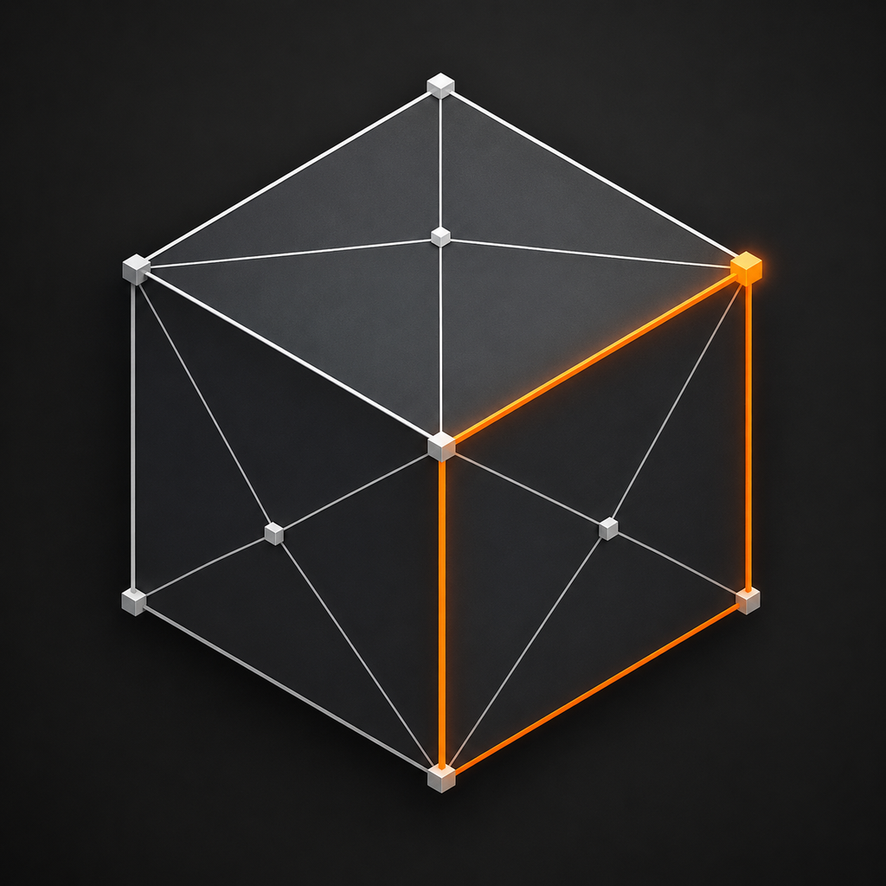

<p align="center">
  
</p>

<h1 align="center">Blender Local</h1>

<p align="center">
  A Blender-style 3D app for iPad, built on the real Blender: the <code>bpy</code> module, bundled inside the app.
</p>

---

Blender Local bundles Blender's own `bpy`, cross-compiled for iOS arm64 in
[python-ios-lib](https://github.com/yu314-coder/python-ios-lib), and draws a
touch-native interface over it with SwiftUI and Metal. Blender holds the scene.
Every button, menu and field runs Blender's own operators and properties, and
the viewport draws what Blender evaluated after each change. Modifiers,
sculpting, rendering and file formats are Blender's, not copies of them.
Everything runs on the device, offline.

**[docs/blender-local.md](docs/blender-local.md)** is the reference for the app:
where the files are, how the pieces fit, how each feature was measured, and the
landmines worth knowing before touching any of it.

## How it works

- **Blender owns the scene.** CPython 3.14 is embedded in the app, and Blender's
  `bpy` is imported into it. The interface changes the scene only through the
  bridge (`BpyBridge`), which runs Blender's operators on the main thread, one
  undo step per action.
- **The viewport mirrors Blender.** After every change,
  `Resources/python/site/_blenderkit_sync.py` reads Blender's evaluated
  depsgraph (meshes after their modifiers, curves, lights, cameras, the edit
  mesh's selection) and hands it to the Metal viewport.
- **Undo is Blender's undo.** Edit ▸ Undo and Redo step Blender's own undo
  stack, with `.blend` checkpoints as the fallback. The scene autosaves, as a
  `.blend`, and comes back on launch.
- **Scripts drive the same Blender.** The Scripting tab runs Python against the
  scene the 3D View shows.

The iOS Simulator has no arm64-iphoneos slice of `bpy`, so there a small Python
stand-in plays Blender's part for UI testing. Device and Mac
(Designed for iPad) builds run the real module.

## What it does

**3D View**
- Add meshes, curves, lattices, empties, cameras, lights and text.
- Select by tap, Box, Circle or Lasso, or from the Select menu and the Outliner.
- Move, Rotate and Scale with a gizmo, with snapping, proportional editing,
  pivots and the 3D cursor.
- The Object menu: Duplicate, Join, Parent, Convert, Set Origin, Apply,
  shading, QuadriFlow Remesh, and more.
- An operator search that runs any of Blender's mesh, object, UV, sculpt,
  paint, curve, animation and render operators by name.

**Edit Mode**
- Vertex, edge and face selection.
- Extrude, Inset, Bevel, Loop Cut, Knife Project, Spin, Bisect, Merge,
  Dissolve, Bridge, Fill, normals, and the redo panel to adjust the last step.
- X, Y, Z and Topology Mirror editing.
- Curves' and lattices' control points.
- Vertex groups and shape keys.

**Modifiers** show every modifier Blender holds, in Blender's order, with
Apply and reordering. These have their own rows:
- **Generate:** Subdivision Surface, Multiresolution, Mirror, Array, Bevel,
  Boolean, Solidify, Screw, Weld, Triangulate, Decimate, Remesh, Edge Split and
  Geometry Nodes.
- **Deform:** Smooth, Laplacian Smooth, Corrective Smooth, Cast, Simple Deform,
  Displace, Wave, Shrinkwrap and Lattice.
- **Normals:** Weighted Normal.

Everything else can be edited through Every Property. A vertex budget keeps a
subdivision or remesh from running the device out of memory.

**Sculpt Mode** uses Blender's Essentials brushes, with Dynamic Topology, Voxel
Remesh, Multiresolution, masks, face sets and symmetry.

**More**
- UV editing: unwrap, Smart UV Project, seams and packing.
- Texture paint.
- Materials: the Principled BSDF's base colour, metallic and roughness.
- Keyframes and a timeline.
- Rendering with Cycles on the Metal GPU, Eevee or Workbench, with progress,
  and camera and light panels.

**Image to 3D Model** turns a photo into a model, on the device:
- **Relief:** depth from Depth Anything V2.
- **Full 3D:** TripoSG, whose weights are downloaded on request.

**Scripting**
- A Monaco editor with Blender-aware completion.
- A Python console and the app's shell commands.

**Files**
- `.blend` save and open.
- Import and export of glTF, OBJ, USD, STL, PLY, FBX and Alembic.
- The app's Documents folder appears in the Files app.

## Testing

Every feature has host test suites (`scripts/run-*-tests.sh`) and checks that
run in desktop Blender 5.2.1 with the app's context
(`scripts/run-*-blender-check.sh`): its undo stack, `gpu.init()`, and the main
thread's window. Changes are also run in the real app on a Mac, as Designed for
iPad, through DEBUG launch hooks. Release builds are scanned so that no hook
ships (`scripts/scan-app.py`).

## Build

```
./scripts/vendor-python.sh /path/to/python-ios-lib
cp Config/Signing.local.xcconfig.example Config/Signing.local.xcconfig   # set your team
xcodegen generate
open BlenderLocal.xcodeproj
```

- **Requirements:** iOS 17.
- **Not committed:** the Python xcframework is about 124 MB, so it is staged
  into `Vendor/`. The project file is generated from `project.yml`.
- **Bundled `bpy`:** device builds stage Blender's `bpy` from python-ios-lib
  (`scripts/stage-blender.sh`).

Your own account details stay out of the repository. Each lives in a file git
ignores, with a committed `.example` beside it:

- `Config/Signing.local.xcconfig`: your development team.
- `ExportOptions.plist`: the team again, for App Store exports.
- `scripts/local.env`: your App Store Connect key and issuer IDs, for
  `push-appstore.sh`, and a device, signing identity and profile, for
  `deploy-device.sh`.

## Layout

```
Sources/BlenderLocalApp/     app entry, keyboard and menu-bar commands
Sources/BlenderLocalBridge/  the bridge to bpy: scene mirror, operators, undo
Sources/BlenderLocalUI/      Metal viewport, 3D View and Scripting, editors
Resources/python/site/       the app's Python side (_blenderkit_*.py) and the simulator's stand-in
tests/                       host suites and desktop-Blender checks
scripts/                     build, staging, test runners, release
docs/                        the app's reference (blender-local.md)
```

## License

This repository's code is MIT (`LICENSE`); `NOTICE.md` says what that covers.
Blender, whose `bpy` device builds bundle, is GPL-2.0-or-later and is not part
of this repository.
